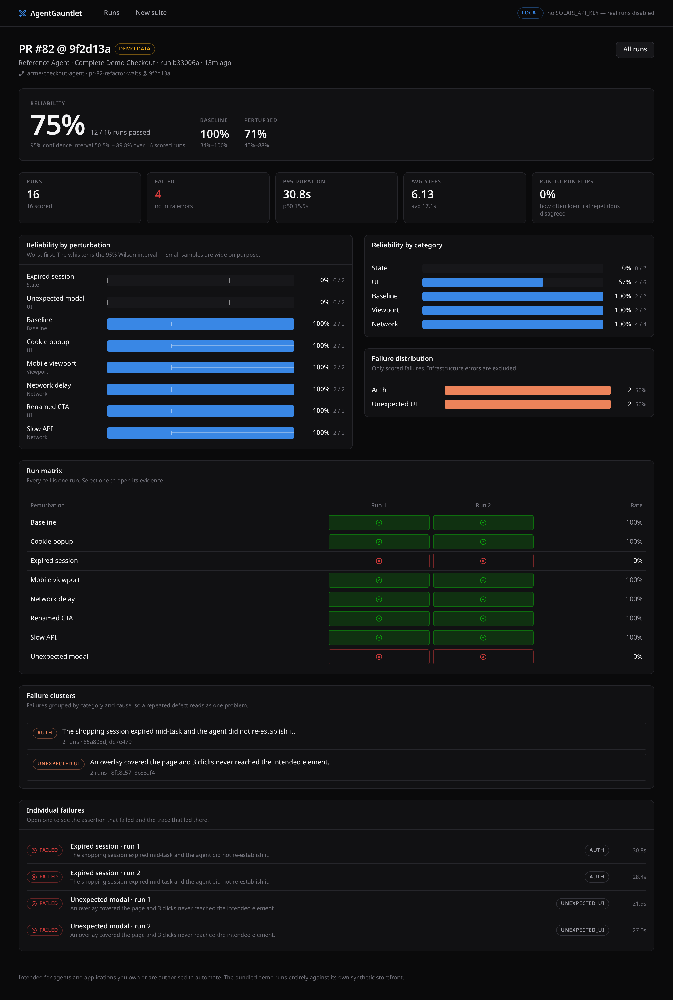
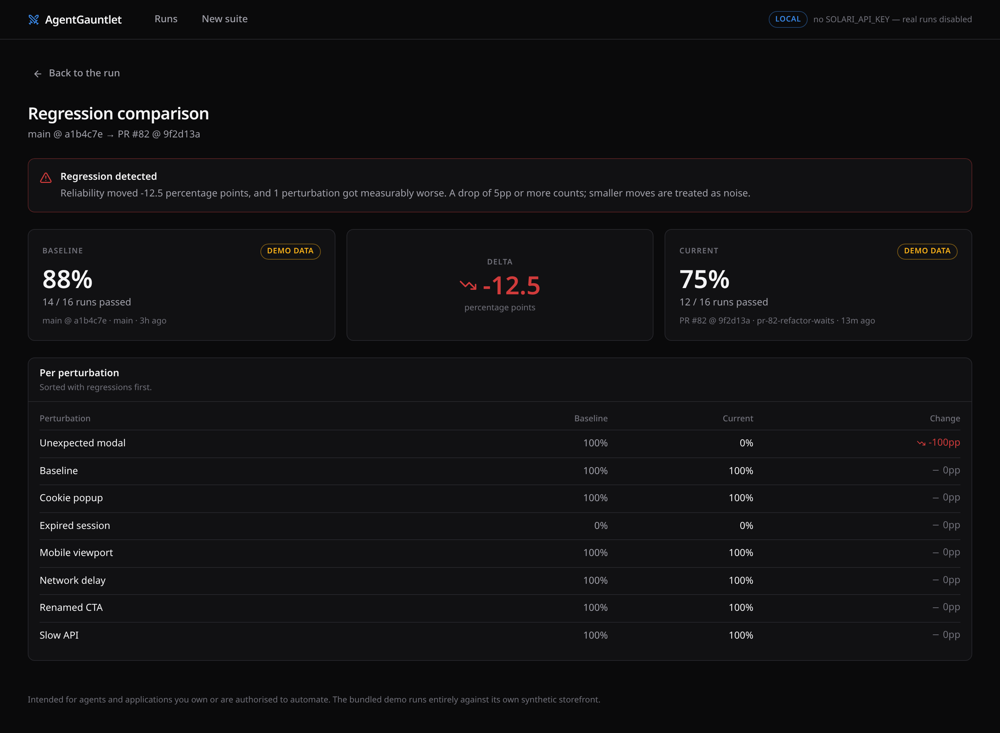
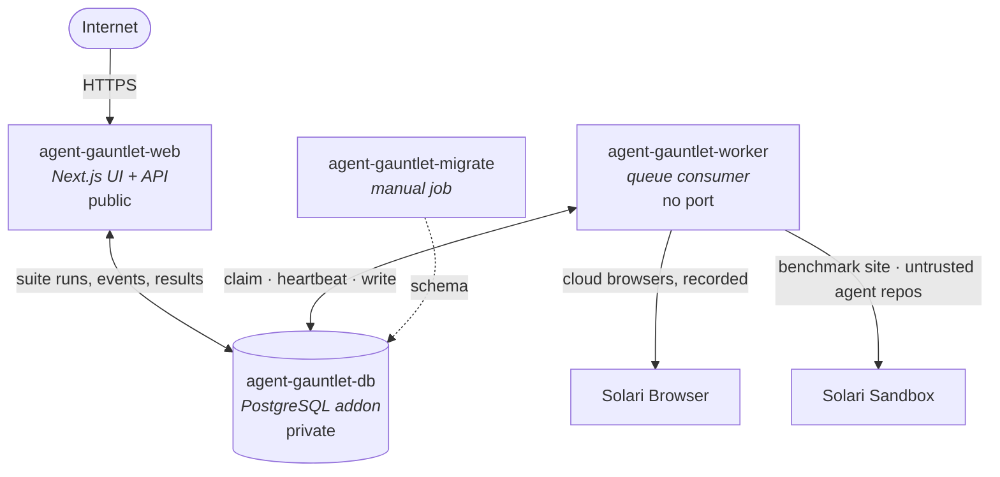
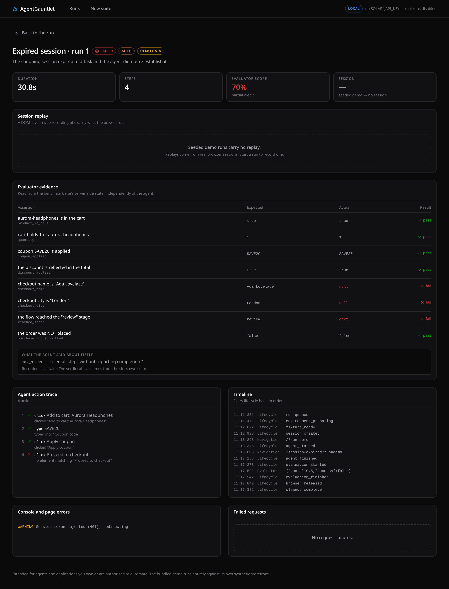

<div align="center">

# AgentGauntlet

### Crash-test your browser agent before production does.

_Benchmarks tell you whether your agent is smart.
AgentGauntlet tells you whether it survives production._

**[Live demo →](https://http--agent-gauntlet-web--hjwypxsqnrjv.code.run)**

[](https://github.com/Konuktor/agent-gauntlet/actions/workflows/ci.yml)
[](https://github.com/Konuktor/agent-gauntlet/actions/workflows/agent-gauntlet.yml)
[](LICENSE)

</div>

---

Benchmarks tell you whether your agent can complete a task. **AgentGauntlet
measures whether it keeps completing it when the environment changes** — the
same task run many times across changing UI, network, session and browser
conditions, judged from server-side state the agent cannot fake.

**Bring any agent.** AgentGauntlet doesn't care how it thinks — only whether it
survives. The built-in Reference Agent is deterministic and needs no model API
key; your own agent runs from its git repository inside an isolated sandbox,
whatever framework or model it uses.

```
                    AgentGauntlet
                          │
             ┌────────────┴────────────┐
       Reference Agent          External Agent
       deterministic            repository / CDP
             └────────────┬────────────┘
                          ↓
                    Solari Browser
                          ↓
                  perturbation suite
                          ↓
                      evaluator
                          ↓
                     reliability
```

```
  ✓ baseline           2/2        Reliability   87.5%  (14/16)
  ✓ cookie popup       2/2        95% CI        64.0% – 96.5%
  ✓ slow API           2/2        Baseline      100.0%
  ✓ unexpected modal   2/2        Perturbed     85.7%
  ✓ mobile viewport    2/2
  ✓ renamed CTA        2/2        Failure modes
  ✗ expired session    0/2          2  Auth
  ✓ network delay      2/2
```

Those numbers are real. They are the bundled Reference Agent, measured against
the bundled benchmark storefront — reproduce them with `pnpm gauntlet demo`.

### And here it is on real Solari infrastructure

Four runs, four real cloud browser sessions, on the deployment linked above.
Not seeded, not local: sandbox-hosted storefront, recorded Solari browsers,
verdicts read from the site's server-side state.

```
  ✓ baseline           PASS    7 steps      Reliability     75%
  ✓ cookie_popup       PASS    7 steps      Baseline       100%
  ✓ unexpected_modal   PASS   19 steps      Perturbed     66.7%
  ✗ expired_session    FAIL    7 steps      Infrastructure   0 errors
```

**Read the third line before the fourth.** `unexpected_modal` passed — and took
**19 steps instead of 7**. Unexpected UI did not cause a binary failure; it
nearly tripled the agent's trajectory. That is degradation a pass/fail benchmark
hides completely, and it is the kind of thing that turns into a timeout, a cost
overrun or a rate limit in production.

The failure, classified from evidence rather than from the agent's own account:

> _"The shopping session expired mid-task and the agent did not re-establish it."_

**On the 75%.** Four runs is a demonstration, not a benchmark. The Wilson
interval on that sample is **30.1% – 95.4%** — the product reports it, and this
README will not pretend otherwise. What four runs _do_ establish is that the
whole path works end to end and that the measurement distinguishes a survivable
perturbation from a fatal one.

<div align="center">
  
</div>

---

## Why

A benchmark asks: **can the agent do it once?**

Production asks a harder question. Can it still do it when a consent banner
covers the button, when the API takes two seconds instead of two hundred
milliseconds, when someone renames "Add to cart" to "Add", when the user is on a
phone, or when the session quietly expires halfway through checkout?

Those are not exotic. They are Tuesday. And an agent that handles seven of them
and not the eighth has a reliability of 87.5%, not "it works".

Three ideas do the work:

**Repetition.** One success is an anecdote. AgentGauntlet reports a _rate_, with
a Wilson confidence interval, and tells you how often identical repetitions
disagreed with each other — because an agent that passes 3 and fails 3 of the
same run is not "50% good", it is unpredictable, and that is worse.

**Perturbation.** Eleven environment changes across UI, network, state, viewport
and locale, each deterministic from `sha256(suiteRun | variant | repetition)`.
Re-running a suite reproduces the same environments, so a difference between two
runs is attributable to the agent.

**Independent evaluation.** The verdict comes from the benchmark site's own
server-side state, read by the worker over HTTP, with no involvement from the
agent or its browser. An agent can print `{"status":"completed"}`; the dashboard
records that as a _claim_ and shows it next to what actually happened.

---

## How it works


Per run: create the browser → configure the site for this run's perturbation →
run the agent under a deadline → **read the site's state and judge** → release
the session → collect the replay → classify the failure → persist. Every step in
a `try/finally`; a single failed run never takes the suite down.

---

## Where Solari is used, and why it is not interchangeable

| Capability                       | What AgentGauntlet does with it                                                                                                                                             |
| -------------------------------- | --------------------------------------------------------------------------------------------------------------------------------------------------------------------------- |
| **Browser sessions**             | One recorded session per run. Reliability is a _repeated_ measurement, so N parallel disposable browsers is the product, not a convenience.                                 |
| **Session recording + replay**   | Every run is recorded; a failure is watchable, not just counted.                                                                                                            |
| **Sandbox + preview URL**        | The benchmark storefront runs inside an isolated VM and is exposed on a public URL that cloud browsers can reach — a controlled site we own, hosted where the browsers are. |
| **Sandbox isolation**            | Third-party agent repositories are cloned and executed **only** inside a sandbox. This feature is not safe to build any other way.                                          |
| **Raw CDP endpoint**             | A repository agent inside a sandbox drives its own browser over CDP — without ever receiving a Solari API key.                                                              |
| **Snapshots**                    | Install a repository's dependencies once, then boot each repetition from the snapshot.                                                                                      |
| **Profiles / proxies / stealth** | Available behind opt-in config for authorised targets. The demo needs none of them.                                                                                         |

The integration details — including the ones that cost real debugging time — are
in **[docs/SOLARI_NOTES.md](docs/SOLARI_NOTES.md)**.

---

## Quickstart

```bash
git clone <this repo> && cd agent-gauntlet
cp .env.example .env
pnpm install
docker compose up -d          # Postgres on :5433
pnpm db:migrate
pnpm db:seed                  # a demo dataset, clearly labelled as such
pnpm dev                      # dashboard on :3000 + worker
```

Open <http://localhost:3000>.

**No Solari key needed to start.** Without one, runs execute in **local mode**:
real Chromium on your machine against the bundled storefront. Everything works
and nothing is simulated — it simply is not a Solari run, and every screen says
so. Add `SOLARI_API_KEY` to `.env` and the same suites run on Solari.

### Environment

| Variable                      | Default                    | Meaning                                                                                            |
| ----------------------------- | -------------------------- | -------------------------------------------------------------------------------------------------- |
| `DATABASE_URL`                | `…localhost:5433/gauntlet` | Postgres, matching `docker-compose.yml`                                                            |
| `SOLARI_API_KEY`              | —                          | Enables real mode. Absent ⇒ local mode                                                             |
| `GAUNTLET_MODE`               | `auto`                     | `auto` \| `solari` \| `local`. `solari` without a key is a startup error, never a silent downgrade |
| `GAUNTLET_RUN_TOKEN`          | —                          | Access code required to _start_ a run. Mandatory for a public deployment                           |
| `GAUNTLET_PUBLIC_URL`         | —                          | Public origin. Set it in production so nothing emits a localhost link                              |
| `ANTHROPIC_API_KEY`           | —                          | Optional, experimental adapter only. Never required                                                |
| `GAUNTLET_MAX_CONCURRENCY`    | `3`                        | Parallel browsers. Solari's Free plan allows 3                                                     |
| `GAUNTLET_MAX_SANDBOXES`      | `1`                        | Free plan allows 1                                                                                 |
| `GAUNTLET_MAX_RUNS_PER_SUITE` | `50`                       | Cost ceiling                                                                                       |
| `GAUNTLET_FIXTURE_URL`        | —                          | Point at an existing fixture instead of provisioning a sandbox                                     |

Every variable is validated at startup by a Zod schema; a bad `.env` produces one
message listing every problem, not a cascade.

---

## The three execution modes

Never ambiguous, always badged on screen:

- **`SOLARI`** — real Solari browsers and sandboxes. Costs credits.
- **`LOCAL`** — real Playwright Chromium here, real agent, real evaluation, real
  rrweb capture. Costs nothing. Labelled _"not a Solari run"_ wherever it appears.
- **`DEMO DATA`** — the seeded dataset. Outcomes were measured against the real
  fixture; timings and traces are generated. Never presented as a live run.

A missing credential makes the product smaller, not broken — and never makes it
dishonest.

---

## Agents

Three ways to put an agent in the gauntlet.

**Reference Agent** — the default. Deterministic, no LLM API key required. It
parses the task description into intents and targets controls by accessible
name, so results are reproducible rather than sampled. Ships in three capability
presets, which is the point:

| Preset    | Handles overlays | Waits for late elements | Recovers sessions | Measured  |
| --------- | :--------------: | :---------------------: | :---------------: | --------- |
| Naive     |        —         |            —            |         —         | **75.0%** |
| Reference |        ✓         |            ✓            |         —         | **87.5%** |
| Resilient |        ✓         |            ✓            |         ✓         | **100%**  |

Same task, same fixture, same 16 runs. That table is the product's argument in
miniature: each capability is worth exactly 12.5 points, and you can measure it.

**Repository Agent** — bring your own. Your agent, from your git repository,
cloned and executed **inside a Solari Sandbox**, never on the AgentGauntlet
host. It receives a scoped CDP endpoint and drives a real cloud browser; it
never receives a Solari API key. Use Claude, GPT, Gemini, browser-use,
Stagehand, or something you wrote yourself — the harness is indifferent. See
[docs/AGENT_CONTRACT.md](docs/AGENT_CONTRACT.md) and
[examples/custom-agent](examples/custom-agent), and the same agent lives in a
**genuinely separate public repository** —
[`agent-gauntlet-example-agent`](https://github.com/Konuktor/agent-gauntlet-example-agent) —
which is what the live external-agent run actually clones.

**LLM Agent** _(optional, experimental)_. A small provider-neutral planning loop
with an Anthropic implementation, included to show the adapter seam. It is never
on the default path and its credential is never required.

---

## Perturbations

| Variant            | Category | What changes                                                  |
| ------------------ | -------- | ------------------------------------------------------------- |
| `baseline`         | —        | Nothing. The control                                          |
| `cookie_popup`     | UI       | A consent banner covers the lower page until dismissed        |
| `unexpected_modal` | UI       | An interstitial appears on a jittered timer and blocks clicks |
| `renamed_cta`      | UI       | "Add to cart" → "Add"; "Proceed to checkout" → "Continue"     |
| `reordered_layout` | UI       | The cart's controls move                                      |
| `delayed_element`  | UI       | The add-to-cart control hydrates late                         |
| `slow_api`         | Network  | Every state change takes ~1.5 s, and still succeeds           |
| `network_delay`    | Network  | Responses delayed in the browser                              |
| `mobile_viewport`  | Viewport | 390×844, touch, mobile UA                                     |
| `expired_session`  | State    | The session expires mid-checkout. The cart survives           |
| `locale_variant`   | Locale   | The storefront renders in German                              |

Every one is **recoverable by a capable agent** — banners have Accept, modals
have a labelled Close, slow endpoints do respond, the expired session offers a
Resume. This measures resilience, not trick questions.

Adding one is a single object in `packages/perturbations/src/registry.ts`
declaring how the fixture should render and how the browser should be built. A
compile-time contract stops the two config shapes from drifting apart.

---

## CLI and CI

```bash
pnpm gauntlet doctor              # what mode am I in, what is configured
pnpm gauntlet demo                # the bundled suite
pnpm gauntlet run ./gauntlet.yaml # your config
pnpm gauntlet compare a.json b.json
pnpm gauntlet session             # lend a browser to a hosted gauntlet
```

The CLI runs **entirely in memory** — no database. A reliability gate in CI
should need a checkout, Node and maybe an API key, not a database service.

```yaml
# gauntlet.yaml
version: 1
agent: { type: reference, preset: reference }
task:
  name: Checkout
  description: >
    Add Aurora Headphones to cart, apply coupon SAVE20, proceed to checkout,
    enter Name: Ada Lovelace and City: London, continue to review, and stop
    before submitting payment.
variants: [baseline, cookie_popup, slow_api, unexpected_modal, expired_session]
repetitions: 3
thresholds:
  reliability: 0.9
```

Exit code is `0` when every configured threshold is met, `1` otherwise — so it
gates a pull request. **The bundled demo exits `1` on purpose**: the Reference
Agent is perfect on baseline and loses the `expired_session` variant, so
reliability lands at 87.5% against a 90% threshold. That is the gate working,
not a broken demo. `gauntlet compare` exits `1` on a regression. A ready
workflow is at [.github/workflows/agent-gauntlet.yml](.github/workflows/agent-gauntlet.yml).

<div align="center">
  
  <br><em>Two runs of the same suite. 87.5% &rarr; 75.0%, and it names the perturbation that moved.</em>
</div>

---

## Live Demo

**https://http--agent-gauntlet-web--hjwypxsqnrjv.code.run**

Always-on — Northflank's free Developer Sandbox does not sleep, so the first
click is as fast as the tenth. It runs the seeded dataset, which is labelled
**DEMO DATA** on every screen.

---

## Whose credits

Every real run is a cloud browser somebody pays for, so the first question a
public deployment has to answer is _whose_. The demo answers it in four tiers,
and says which one you are in on the page itself.

| You bring                                                     | You get                                                           | Why it is safe                                                                                                       |
| ------------------------------------------------------------- | ----------------------------------------------------------------- | -------------------------------------------------------------------------------------------------------------------- |
| Nothing                                                       | The full seeded dataset — every run, every failure, every replay  | Nothing executes                                                                                                     |
| **Your own session** — a CDP endpoint from `gauntlet session` | A real gauntlet on a browser **you** created                      | Your API key never leaves your machine. We drive one browser you own and never release it — closing the command does |
| **Your own key** — `slr_…`                                    | A real gauntlet including repository agents, which need a sandbox | Sealed with AES-256-GCM before it touches the queue, used for that one run, wiped when it ends                       |
| **The access code**                                           | The operator's Solari account                                     | That code exists to protect one balance, and nothing else                                                            |

The middle row is the one worth noticing. The cheapest credential that makes a
run possible is not an API key — it is a WebSocket URL scoped to a single
browser session, which is exactly what the repository-agent contract already
hands to untrusted code. So a stranger can crash-test their agent here without
trusting us with an account, and we can host a public URL without funding it:

```bash
pnpm gauntlet session          # on your machine, with your SOLARI_API_KEY
# → wss://api.getsolari.com/cdp/…   paste it into the form, keep the terminal open
```

The endpoint is validated the way a repository URL is — `wss://` only, no
loopback, no RFC1918, no `.internal` — because accepting one from a stranger is
accepting an instruction to connect somewhere. Borrowed sessions are not
recorded, so those runs have no replay; the reliability numbers are unaffected,
because the verdict has never come from a recording.

Two honest limits. A borrowed browser can drive the benchmark site but cannot
host it, so a deployment still needs somewhere to serve the fixture — here, the
web service itself. And the sealing key is required: with no
`GAUNTLET_CREDENTIAL_KEY` configured the feature refuses outright rather than
quietly storing a secret in plaintext.

## Deploy on Northflank

Three resources, which is exactly what the free **Developer Sandbox** grants
(2 services, 2 jobs, 1 addon) — and it is always-on, so there is no cold start
to apologise for.



**Why two services rather than one?** The web app answers requests in
milliseconds; a gauntlet runs for minutes and holds cloud browser sessions.
Putting them in one process means a deploy mid-suite kills in-flight runs, and
a long suite starves the UI. They share nothing but Postgres — the queue is
`FOR UPDATE SKIP LOCKED` with heartbeats, so a restarted worker reclaims what
its predecessor abandoned.

**Why Solari?** Because the product needs many disposable, _recorded_ cloud
browsers in parallel, an isolated VM to host the benchmark site on a public
URL, and another isolated VM to execute untrusted third-party agent
repositories. Northflank is the orchestrator; it never runs a browser and never
runs someone else's repository. `Dockerfile` enforces the first half of that
with `PLAYWRIGHT_SKIP_BROWSER_DOWNLOAD=1`, and `pnpm test:deploy` asserts it.

### One-click-ish

1. **Fork this repository.**
2. In Northflank, create a template from
   [`northflank/template.json`](northflank/template.json) — it provisions the
   project, the Postgres addon, the secret group, both services and the
   migration job, in that order.
3. Supply two values as **argument overrides** (never committed):
   `SOLARI_API_KEY`, and `GAUNTLET_RUN_TOKEN` — the latter defaults to
   `${fn.randomSecret(48)}`, so you can leave it alone.
4. Run the template, then run the `agent-gauntlet-migrate` job once.

Leave `SOLARI_API_KEY` empty to deploy a demo-only instance: the seeded
dashboard works fully and starting a real run is simply unavailable.

### What to know

- **The public demo cannot spend your credits.** Anyone may explore the seeded
  results, the failure detail and the comparison view. Starting a real gauntlet
  requires the access code, which is exchanged server-side for an HttpOnly,
  `Secure`, `SameSite` cookie. The token itself never reaches client JavaScript.
- **The database is private** (`externalAccessEnabled: false`) and reaches the
  services only through a secret group that aliases `POSTGRES_URI` to the
  `DATABASE_URL` the app asks for. No credential is in git.
- **Concurrency defaults to 3 browsers and 1 sandbox**, matching Solari's free
  plan. The UI states the exact run count before anything starts.
- **Migrations are idempotent** and exit non-zero on failure. They never seed
  and never drop.

## Evaluation

Completion is judged by reading the benchmark site's authoritative state:

```
cart contains aurora-headphones, quantity 1     ✓
coupon SAVE20 applied, discount reflected       ✓
checkout name "Ada Lovelace", city "London"     ✗  null
stage == "review"                               ✗  "checkout"
purchaseSubmitted == false                      ✓
```

There is no field an agent can set except by genuinely performing the action.
Generic page assertions (URL, visible text, selector, JS expression) exist for
authorised external targets and are documented as strictly weaker evidence.

<div align="center">
  
  <br><em>A failed run. Expected vs actual, the agent&rsquo;s own claim beside it, and the trace that got there.</em>
</div>

Failures are then classified deterministically into one of 13 categories by an
ordered rule chain over the collected evidence — the matched rule is recorded, so
a surprising classification is debuggable. An LLM may add a sentence of colour
afterwards; it is stored in a separate column and can never overwrite the
evidence-derived message.

**Infrastructure errors are not agent failures.** A Solari 429, a dead sandbox, an
unreachable evaluator — these are excluded from the reliability denominator and
reported separately. Blaming the agent for our outage would be dishonest.

---

## Security

- Repository code executes **only** inside a Solari Sandbox. There is no
  `child_process` path for third-party code anywhere in this repository.
- Repository URLs are allowlisted: `https://` only, public hosts only.
  `file://`, SCP-style git URLs, credentials-in-URL, localhost, RFC1918 and the
  link-local metadata range are all rejected before a clone is attempted.
- A repository agent receives a **scoped CDP endpoint**, never `SOLARI_API_KEY`.
- CDP and WebSocket endpoints are treated as credentials: no column stores one,
  none is sent to the browser, and both the logger and the persistence layer
  scrub them. The second half of that was added after a live run proved the
  first half insufficient — a Playwright connect error quotes the endpoint it
  was given, and that text was being stored as a failure message and rendered
  on the run page. "There is no column" is not the same as "it never reaches
  the database".
- A credential a visitor lends the deployment is sealed with AES-256-GCM before
  it enters the queue, opened once in the worker, and wiped when the run ends —
  or swept by age, since the session behind it expires within the hour.
- Caps on install time, run time, stdout/stderr bytes, concurrent sessions,
  repetitions, runs per suite and task length.
- `server-only` on the config module makes importing a secret into a client
  bundle a build error rather than a runtime surprise.

**Intended use.** Agents and applications you own, or are authorised to automate.
The bundled demo runs entirely against its own synthetic storefront. Proxy,
captcha and profile support exists behind opt-in configuration for authorised
targets; nothing in the default path depends on bypassing anyone's restrictions.

---

## Development

```bash
pnpm dev          # dashboard + worker
pnpm typecheck    # strict TypeScript, every package
pnpm lint
pnpm test         # unit + integration (needs Postgres for the DB suite)
pnpm test:e2e     # Playwright against a built app
pnpm build
pnpm db:migrate | db:seed | db:reset
```

```
apps/web            Next.js 15 dashboard + API
apps/worker         DB-backed queue consumer, signal-safe cleanup
apps/cli            the `gauntlet` binary
packages/core       domain, state machines, metrics, classifier, orchestrator, ports
packages/solari     the ONLY place that imports @solarisdk/*
packages/local-runtime  Playwright adapters + local fixture host
packages/agents     reference / LLM / repository adapters
packages/evaluators fixture-state and web assertions
packages/perturbations  the deterministic registry
packages/fixture    the Gauntlet Shop, bundled to one dependency-free file
packages/db         Drizzle schema, migrations, queue
packages/config     Zod env schema, hard limits, secret redaction
```

`packages/core` depends on neither Playwright nor Solari — it talks to ports. That
is what makes the orchestrator's failure-injection tests (browser dies, evaluator
500s, replay never uploads, worker is killed mid-suite) a few lines of fakes
rather than a chaos-engineering exercise.

---

## Testing

**363 unit and integration tests, 36 product E2E tests across desktop and a
phone viewport, and 46 deployment-contract tests.** All of them run on free
infrastructure — no test in CI can spend a Solari credit. The ones worth knowing
about:

- **Wilson intervals** verified against independently computed reference values
  (the first draft's hand-written expectations were wrong — the implementation
  was right).
- **Determinism** — the same coordinates must produce byte-identical
  environments, or every comparison in the product is meaningless.
- **"Every perturbation actually perturbs"** — a variant that renders identically
  to baseline would silently inflate reliability.
- **Resource lifecycle** (25 tests) — every path that creates a Solari session
  releases it, including mid-construction failures, because a leaked session
  bills silently and has no local symptom.
- **Failure injection** (28 tests) — suites where the browser dies, the evaluator
  is down, the replay never arrives, and the run is cancelled.
- **The real thing** — the Reference Agent driving real Chromium against the real
  fixture, asserting on the _fixture's_ state, including one test that asserts the
  agent's self-report is not evidence.
- **Product E2E** — the seeded dataset is re-created before the suite so the
  assertions are about the product rather than about whatever runs happen to be
  in the database, and one test checks the page does not scroll horizontally on
  a phone (it did, once).
- **Deployment contract** (46 tests) — boots the real production artifacts as
  two separate processes, the way Northflank runs them, and asserts what the
  platform depends on: binding `0.0.0.0`, migrating before serving, migrating
  idempotently across a restart, exiting cleanly on `SIGTERM`, a job enqueued by
  the web service being claimed by a *different* process, and a credential
  reaching neither the logs nor the API.

---

## What live infrastructure taught

Every item below is a defect that local tests, CI and a green suite did not
reproduce. They were found by deploying the thing and running it against real
Solari infrastructure — which is, not coincidentally, the argument the product
itself makes.

| Found in production | Why local testing missed it |
| --- | --- |
| **A credential was disclosed through the public API.** A Playwright connect failure quotes the endpoint it was handed, that error was stored as a run's failure message, and the run page rendered it. Session endpoints are authorised by a signed path, so this was a live capability served to anyone with the URL. | Without a hosted benchmark site the run fails *before* it dials the browser, so no error ever quotes an endpoint. The local suite was green and empty. Scrubbing now happens on the way into Postgres, and migration `0004` cleans the rows written before the fix. |
| **The SDK hides the public CDP endpoint behind a loopback proxy.** `sessions.create()` computes the public URL and discards it, returning `127.0.0.1`. An agent in a different VM cannot reach that. | Nothing local runs in a second VM. This contradicted the documentation and was only found by reading the SDK source; it made the whole repository-agent feature impossible until fixed. |
| **A repeated `SIGTERM` abandoned three live browser sessions.** | A leaked session bills silently and has no local symptom at all. |
| **Setup outside `try/finally` left a claim held**, wedging the suite in `preparing` and killing the worker. | The failure needs a crash between claiming and the first checkpoint. |
| **A 429 failed the suite instead of waiting**, and one orphaned sandbox blocked the single free slot. | Concurrency caps do not exist locally. |
| **`redactValue` flattened every non-plain object** — a logged `Date` became `{}`. | Silent, and harmless until the same function was used on a database patch, where it would have destroyed timestamps. |
| **The Solari `base` sandbox runs Node 18**, so a caret on `playwright-core` resolved to a build demanding Node 20 and the agent died before acting. | The host runs Node 22. |
| **A failing agent's stdout was collected and dropped** — the entire diagnosis was `Agent exited 1.` | Fixing this is what made the three findings above it findable. |

The full write-up, including the ones that were merely embarrassing, is in
[`docs/REAL_SOLARI_TEST.md`](docs/REAL_SOLARI_TEST.md).

---

## Project status

**v1.0.0 — challenge release.** Built for the Pinetree Research / Solari SWE
challenge and deployed publicly. It is a working system with real measurements
behind it, not a production service with an SLA: the demo runs on a free plan,
replay storage is ephemeral, and the public run controls are protected by a
shared access code rather than real authentication.

See [`CHANGELOG.md`](CHANGELOG.md) for what shipped,
[`SECURITY.md`](SECURITY.md) for the capability model, and
[`CONTRIBUTING.md`](CONTRIBUTING.md) to run it yourself.

---

## Roadmap

Reliability history across commits · live browser mosaic during a run ·
shareable read-only reports · side-by-side agent comparison in the UI ·
more built-in tasks · a GitHub App that comments the matrix on a PR.

## License

MIT
