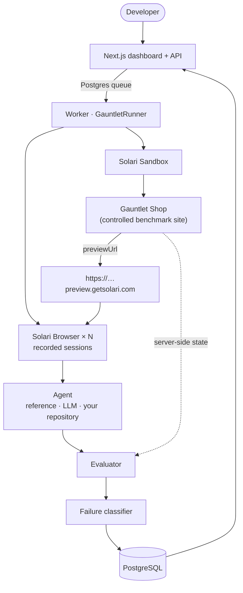

<div align="center">

# AgentGauntlet

### Crash-test your browser agent before production does.

*Benchmarks tell you whether your agent is smart.
AgentGauntlet tells you whether it survives production.*

</div>

---

A browser agent passing once proves almost nothing. AgentGauntlet runs the same
task **many times, across changing UI, network, session and browser conditions**,
judges completion from server-side state the agent cannot fake, and shows you
exactly where it breaks.

```
  ✓ baseline           2/2        Reliability   87.5%  (14/16)
  ✓ cookie popup       2/2        95% CI        64.0% – 96.5%
  ✓ slow API           2/2        Baseline      100.0%
  ✓ unexpected modal   2/2        Perturbed     85.7%
  ✓ mobile viewport    2/2
  ✓ renamed CTA        2/2        Failure modes
  ✗ expired session    0/2          2  Auth
  ✓ network delay      2/2
```

Those numbers are real. They are the bundled Reference Agent, measured against
the bundled benchmark storefront — reproduce them with `pnpm gauntlet demo`.

---

## Why

A benchmark asks: **can the agent do it once?**

Production asks a harder question. Can it still do it when a consent banner
covers the button, when the API takes two seconds instead of two hundred
milliseconds, when someone renames "Add to cart" to "Add", when the user is on a
phone, or when the session quietly expires halfway through checkout?

Those are not exotic. They are Tuesday. And an agent that handles seven of them
and not the eighth has a reliability of 87.5%, not "it works".

Three ideas do the work:

**Repetition.** One success is an anecdote. AgentGauntlet reports a *rate*, with
a Wilson confidence interval, and tells you how often identical repetitions
disagreed with each other — because an agent that passes 3 and fails 3 of the
same run is not "50% good", it is unpredictable, and that is worse.

**Perturbation.** Eleven environment changes across UI, network, state, viewport
and locale, each deterministic from `sha256(suiteRun | variant | repetition)`.
Re-running a suite reproduces the same environments, so a difference between two
runs is attributable to the agent.

**Independent evaluation.** The verdict comes from the benchmark site's own
server-side state, read by the worker over HTTP, with no involvement from the
agent or its browser. An agent can print `{"status":"completed"}`; the dashboard
records that as a *claim* and shows it next to what actually happened.

---

## How it works



Per run: create the browser → configure the site for this run's perturbation →
run the agent under a deadline → **read the site's state and judge** → release
the session → collect the replay → classify the failure → persist. Every step in
a `try/finally`; a single failed run never takes the suite down.

---

## Where Solari is used, and why it is not interchangeable

| Capability | What AgentGauntlet does with it |
|---|---|
| **Browser sessions** | One recorded session per run. Reliability is a *repeated* measurement, so N parallel disposable browsers is the product, not a convenience. |
| **Session recording + replay** | Every run is recorded; a failure is watchable, not just counted. |
| **Sandbox + preview URL** | The benchmark storefront runs inside an isolated VM and is exposed on a public URL that cloud browsers can reach — a controlled site we own, hosted where the browsers are. |
| **Sandbox isolation** | Third-party agent repositories are cloned and executed **only** inside a sandbox. This feature is not safe to build any other way. |
| **Raw CDP endpoint** | A repository agent inside a sandbox drives its own browser over CDP — without ever receiving a Solari API key. |
| **Snapshots** | Install a repository's dependencies once, then boot each repetition from the snapshot. |
| **Profiles / proxies / stealth** | Available behind opt-in config for authorised targets. The demo needs none of them. |

The integration details — including the ones that cost real debugging time — are
in **[docs/SOLARI_NOTES.md](docs/SOLARI_NOTES.md)**.

---

## Quickstart

```bash
git clone <this repo> && cd agent-gauntlet
cp .env.example .env
pnpm install
docker compose up -d          # Postgres on :5433
pnpm db:migrate
pnpm db:seed                  # a demo dataset, clearly labelled as such
pnpm dev                      # dashboard on :3000 + worker
```

Open <http://localhost:3000>.

**No Solari key needed to start.** Without one, runs execute in **local mode**:
real Chromium on your machine against the bundled storefront. Everything works
and nothing is simulated — it simply is not a Solari run, and every screen says
so. Add `SOLARI_API_KEY` to `.env` and the same suites run on Solari.

### Environment

| Variable | Default | Meaning |
|---|---|---|
| `DATABASE_URL` | `…localhost:5433/gauntlet` | Postgres, matching `docker-compose.yml` |
| `SOLARI_API_KEY` | — | Enables real mode. Absent ⇒ local mode |
| `GAUNTLET_MODE` | `auto` | `auto` \| `solari` \| `local`. `solari` without a key is a startup error, never a silent downgrade |
| `ANTHROPIC_API_KEY` | — | Only for the optional LLM agent |
| `GAUNTLET_MAX_CONCURRENCY` | `3` | Parallel browsers. Solari's Free plan allows 3 |
| `GAUNTLET_MAX_SANDBOXES` | `1` | Free plan allows 1 |
| `GAUNTLET_MAX_RUNS_PER_SUITE` | `50` | Cost ceiling |
| `GAUNTLET_FIXTURE_URL` | — | Point at an existing fixture instead of provisioning a sandbox |

Every variable is validated at startup by a Zod schema; a bad `.env` produces one
message listing every problem, not a cascade.

---

## The three execution modes

Never ambiguous, always badged on screen:

- **`SOLARI`** — real Solari browsers and sandboxes. Costs credits.
- **`LOCAL`** — real Playwright Chromium here, real agent, real evaluation, real
  rrweb capture. Costs nothing. Labelled *"not a Solari run"* wherever it appears.
- **`DEMO DATA`** — the seeded dataset. Outcomes were measured against the real
  fixture; timings and traces are generated. Never presented as a live run.

A missing credential makes the product smaller, not broken — and never makes it
dishonest.

---

## Agents

Three ways to put an agent in the gauntlet.

**Reference Agent** (built in, no credentials). A deterministic agent that parses
the task description into intents and targets controls by accessible name. It
ships in three capability presets, which is the point:

| Preset | Handles overlays | Waits for late elements | Recovers sessions | Measured |
|---|:--:|:--:|:--:|---|
| Naive | — | — | — | **75.0%** |
| Reference | ✓ | ✓ | — | **87.5%** |
| Resilient | ✓ | ✓ | ✓ | **100%** |

Same task, same fixture, same 16 runs. That table is the product's argument in
miniature: each capability is worth exactly 12.5 points, and you can measure it.

**LLM Agent.** A provider-neutral loop — observe, plan one schema-constrained
action, execute, repeat — with an Anthropic implementation. Observations are
bounded (URL, title, ≤2 KB of visible text, ≤40 interactive elements, the last
five actions); no raw DOM is ever sent.

**Repository Agent.** Your agent, from your git repository, cloned and executed
**inside a Solari Sandbox** — never on the AgentGauntlet host. See
[docs/AGENT_CONTRACT.md](docs/AGENT_CONTRACT.md) and
[examples/custom-agent](examples/custom-agent).

---

## Perturbations

| Variant | Category | What changes |
|---|---|---|
| `baseline` | — | Nothing. The control |
| `cookie_popup` | UI | A consent banner covers the lower page until dismissed |
| `unexpected_modal` | UI | An interstitial appears on a jittered timer and blocks clicks |
| `renamed_cta` | UI | "Add to cart" → "Add"; "Proceed to checkout" → "Continue" |
| `reordered_layout` | UI | The cart's controls move |
| `delayed_element` | UI | The add-to-cart control hydrates late |
| `slow_api` | Network | Every state change takes ~1.5 s, and still succeeds |
| `network_delay` | Network | Responses delayed in the browser |
| `mobile_viewport` | Viewport | 390×844, touch, mobile UA |
| `expired_session` | State | The session expires mid-checkout. The cart survives |
| `locale_variant` | Locale | The storefront renders in German |

Every one is **recoverable by a capable agent** — banners have Accept, modals
have a labelled Close, slow endpoints do respond, the expired session offers a
Resume. This measures resilience, not trick questions.

Adding one is a single object in `packages/perturbations/src/registry.ts`
declaring how the fixture should render and how the browser should be built. A
compile-time contract stops the two config shapes from drifting apart.

---

## CLI and CI

```bash
pnpm gauntlet doctor              # what mode am I in, what is configured
pnpm gauntlet demo                # the bundled suite
pnpm gauntlet run ./gauntlet.yaml # your config
pnpm gauntlet compare a.json b.json
```

The CLI runs **entirely in memory** — no database. A reliability gate in CI
should need a checkout, Node and maybe an API key, not a database service.

```yaml
# gauntlet.yaml
version: 1
agent: { type: reference, preset: reference }
task:
  name: Checkout
  description: >
    Add Aurora Headphones to cart, apply coupon SAVE20, proceed to checkout,
    enter Name: Ada Lovelace and City: London, continue to review, and stop
    before submitting payment.
variants: [baseline, cookie_popup, slow_api, unexpected_modal, expired_session]
repetitions: 3
thresholds:
  reliability: 0.9
```

Exit code is `0` when every configured threshold is met, `1` otherwise — so it
gates a pull request. `gauntlet compare` exits `1` on a regression. A ready
workflow is at [.github/workflows/agent-gauntlet.yml](.github/workflows/agent-gauntlet.yml).

---

## Evaluation

Completion is judged by reading the benchmark site's authoritative state:

```
cart contains aurora-headphones, quantity 1     ✓
coupon SAVE20 applied, discount reflected       ✓
checkout name "Ada Lovelace", city "London"     ✗  null
stage == "review"                               ✗  "checkout"
purchaseSubmitted == false                      ✓
```

There is no field an agent can set except by genuinely performing the action.
Generic page assertions (URL, visible text, selector, JS expression) exist for
authorised external targets and are documented as strictly weaker evidence.

Failures are then classified deterministically into one of 13 categories by an
ordered rule chain over the collected evidence — the matched rule is recorded, so
a surprising classification is debuggable. An LLM may add a sentence of colour
afterwards; it is stored in a separate column and can never overwrite the
evidence-derived message.

**Infrastructure errors are not agent failures.** A Solari 429, a dead sandbox, an
unreachable evaluator — these are excluded from the reliability denominator and
reported separately. Blaming the agent for our outage would be dishonest.

---

## Security

- Repository code executes **only** inside a Solari Sandbox. There is no
  `child_process` path for third-party code anywhere in this repository.
- Repository URLs are allowlisted: `https://` only, public hosts only.
  `file://`, SCP-style git URLs, credentials-in-URL, localhost, RFC1918 and the
  link-local metadata range are all rejected before a clone is attempted.
- A repository agent receives a **scoped CDP endpoint**, never `SOLARI_API_KEY`.
- CDP and WebSocket endpoints are treated as credentials: never persisted (there
  is no column), never sent to the browser, redacted from logs.
- Caps on install time, run time, stdout/stderr bytes, concurrent sessions,
  repetitions, runs per suite and task length.
- `server-only` on the config module makes importing a secret into a client
  bundle a build error rather than a runtime surprise.

**Intended use.** Agents and applications you own, or are authorised to automate.
The bundled demo runs entirely against its own synthetic storefront. Proxy,
captcha and profile support exists behind opt-in configuration for authorised
targets; nothing in the default path depends on bypassing anyone's restrictions.

---

## Development

```bash
pnpm dev          # dashboard + worker
pnpm typecheck    # strict TypeScript, every package
pnpm lint
pnpm test         # unit + integration (needs Postgres for the DB suite)
pnpm test:e2e     # Playwright against a built app
pnpm build
pnpm db:migrate | db:seed | db:reset
```

```
apps/web            Next.js 15 dashboard + API
apps/worker         DB-backed queue consumer, signal-safe cleanup
apps/cli            the `gauntlet` binary
packages/core       domain, state machines, metrics, classifier, orchestrator, ports
packages/solari     the ONLY place that imports @solarisdk/*
packages/local-runtime  Playwright adapters + local fixture host
packages/agents     reference / LLM / repository adapters
packages/evaluators fixture-state and web assertions
packages/perturbations  the deterministic registry
packages/fixture    the Gauntlet Shop, bundled to one dependency-free file
packages/db         Drizzle schema, migrations, queue
packages/config     Zod env schema, hard limits, secret redaction
```

`packages/core` depends on neither Playwright nor Solari — it talks to ports. That
is what makes the orchestrator's failure-injection tests (browser dies, evaluator
500s, replay never uploads, worker is killed mid-suite) a few lines of fakes
rather than a chaos-engineering exercise.

---

## Testing

**290 tests.** The ones worth knowing about:

- **Wilson intervals** verified against independently computed reference values
  (the first draft's hand-written expectations were wrong — the implementation
  was right).
- **Determinism** — the same coordinates must produce byte-identical
  environments, or every comparison in the product is meaningless.
- **"Every perturbation actually perturbs"** — a variant that renders identically
  to baseline would silently inflate reliability.
- **Resource lifecycle** (25 tests) — every path that creates a Solari session
  releases it, including mid-construction failures, because a leaked session
  bills silently and has no local symptom.
- **Failure injection** (28 tests) — suites where the browser dies, the evaluator
  is down, the replay never arrives, and the run is cancelled.
- **The real thing** — the Reference Agent driving real Chromium against the real
  fixture, asserting on the *fixture's* state, including one test that asserts the
  agent's self-report is not evidence.

---

## Roadmap

Reliability history across commits · live browser mosaic during a run ·
shareable read-only reports · side-by-side agent comparison in the UI ·
more built-in tasks · a GitHub App that comments the matrix on a PR.

## License

MIT
